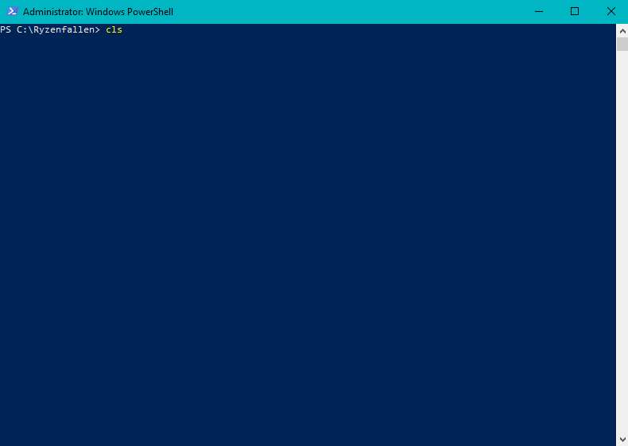

# Ryzenfallen

RyzenFallen is a Windows Proof-of-Concept exploit for the *Ryzenfall* series of vulnerabilities discovered by CTS Labs.

## Background

*Ryzenfall* describes a vulnerability around inappropriate (well, missing, really) access control to the C2P mailbox transport (which is used for communication between the BIOS/SMM and the PSP). CTS Labs discovered that access to the mailbox from CPL0 was permitted which enabled the abuse of various C2P commands to build highly-privileged arbitrary read/write primitives (which, in turn, can be used for data corruption or to gain code execution in all CPLs, SMM and the PSP itself).

## PoC

The PoC consists of a WDF (KMDF) driver that is used to access the C2P mailbox from CPL0. It exploits mailbox command *8* for an arbitrary read-what-where of physical memory (and, possibly, io space). The PoC shows how the Windows Memory Manager (*Mm*) can be used to translate system space virtual addresses to their backing physical addresses - and how user-mode context can be switched in kernel-mode to allow for the discovery of physical addresses backing user-mode VAs.

The write-what-where functionality has been redaced from the public release of this PoC. While further research on the back of this code is always encouraged, I'd ask that **technical details of such work that results in arbw be shared responsibly**.

The impetus for releasing this work at this time is that sufficient details for reproduction of the vulnerability have now been made public in the recent BlueHatIL presentation by the original finders from CTS Labs.

*Tested on my Ryzen 2700X, Gigabyte AX370 Gaming 5 running a maximum firmware version of F23.*

## Patching

Please be aware that AMD have patched the Ryzenfall vulnerability on affected machines. On desktop SKUs the fix is available from AGESA 1.0.0.4 (on my Gigabyte AX370 board - F23). AMD make *excellent* hardware which is only getting better with time (I'm a big fan); if there is one takeaway from this PoC for anyone running an affected AMD system is that **you should patch immediately**. 
